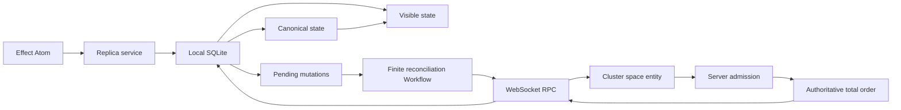

# Effect Local

Effect Local is a local first mutation log for Effect applications. A client commits mutations optimistically to
local SQLite, works while offline, and reconciles with an authoritative server assigned order when connectivity
returns. Effect Schema defines every domain, durable, and wire contract. Effect services, Layers, scopes, streams,
and Atom own the runtime.

The library targets Effect `4.0.0-beta.103`. It has not published a stable release. Durable and public contracts may
change before v1.

## Architecture



One local transaction allocates a stable mutation identity, runs the handler, stores the pending envelope and write
set, and updates visible state. The server authenticates and authorizes the mutation, deduplicates exact retries,
executes the same handler, and either stores a terminal rejection or appends public mutation identity plus canonical
changes at the next dense sequence. The submitting client's result remains in its private receipt. A client installs
contiguous accepted entries into canonical state and then replays its remaining pending mutations over that state.

Effect Cluster owns deployment neutral routing and live ownership. One entity per space serializes mutation admission,
holds wake and presence recipients, and routes them across runners. The actor does not retain mutation payloads or
replies in Cluster message history. Server SQL stores bounded authoritative history, bounded receipts, immutable state
snapshots, and explicit retained floors. Clients retain pending mutations, a durable cursor, and resumable bootstrap
staging in SQLite. Effect Workflow owns durable client scheduling through finite reconciliation generations.

Ordinary fields store ordinary values. Applications that need concurrent intent for a specific field can use an
explicit `Field.Semantics` such as a counter or grow only set. Every other model avoids causal metadata.

See [architecture](docs/architecture.md), [durability](docs/durability.md), and [synchronization](docs/sync.md) for the
invariants and failure model.

## Packages

| Package                              | Purpose                                                           |
| ------------------------------------ | ----------------------------------------------------------------- |
| `@lucas-barake/effect-local`         | Models, mutations, queries, field semantics, protocol, and errors |
| `@lucas-barake/effect-local-sql`     | SQLite state, server log, and Workflow reconciliation             |
| `@lucas-barake/effect-local-rpc`     | WebSocket RPC, Cluster space routing, and presence                |
| `@lucas-barake/effect-local-browser` | Browser SQLite ports, Effect Atom graph, and local presence       |
| `@lucas-barake/effect-local-test`    | Production shaped test layers and deterministic network faults    |

All packages are ESM. Public modules are available as subpaths such as
`@lucas-barake/effect-local/Mutation`. Paths under `internal/*` are private.

## Domain definition

```ts
import * as Definition from "@lucas-barake/effect-local/Definition"
import * as Model from "@lucas-barake/effect-local/Model"
import * as Mutation from "@lucas-barake/effect-local/Mutation"
import * as Query from "@lucas-barake/effect-local/Query"
import * as Effect from "effect/Effect"
import * as Layer from "effect/Layer"
import * as Option from "effect/Option"
import * as Schema from "effect/Schema"

export const Task = Model.make("Task", {
  version: 1,
  key: Schema.String,
  schema: Schema.Struct({
    id: Schema.String,
    title: Schema.NonEmptyString,
    completed: Schema.Boolean
  })
})

export const PutTask = Mutation.make("PutTask", {
  version: 1,
  payload: Task.schema,
  success: Task.schema
})

export const ToggleTask = Mutation.make("ToggleTask", {
  version: 1,
  payload: { id: Schema.String }
})

export const ListTasks = Query.make("ListTasks", {
  success: Schema.Array(Task.schema),
  dependsOn: [Task]
})

export const definition = Definition.make({
  version: 1,
  models: [Task],
  mutations: [PutTask, ToggleTask],
  queries: [ListTasks]
})

export const DomainLive = Layer.mergeAll(
  PutTask.toLayer(({ payload, transaction }) => transaction.set(Task, payload.id, payload).pipe(Effect.as(payload))),
  ToggleTask.toLayer(({ payload, transaction }) =>
    transaction.get(Task, payload.id).pipe(
      Effect.flatMap(Option.match({
        onNone: () => Effect.void,
        onSome: (task) => transaction.set(Task, task.id, { ...task, completed: !task.completed })
      }))
    )
  ),
  ListTasks.toLayer(({ query }) => query.all(Task))
)
```

Handler dependencies are ordinary Effect requirements. `toLayer` captures them once when the Layer is built. Handler
failures declared by the mutation or query Schema stay in the typed error channel. Storage, protocol, capacity,
authorization, and identity failures use the tagged classes in `ReplicaError`.

Handlers must be deterministic. Put timestamps, random values, generated identifiers, and other nondeterministic
inputs in the mutation payload before committing it.

## SQLite replica

`SqlReplica.layer` assembles the public `Replica` service from a local store, query executor, and scoped reconciler.
Supply the domain handlers, a `SqlClient`, `Crypto`, and a `SyncEngine`:

```ts
import { NodeCrypto } from "@effect/platform-node"
import { SqliteClient } from "@effect/sql-sqlite-node"
import * as SqlReplica from "@lucas-barake/effect-local-sql/SqlReplica"
import * as Identity from "@lucas-barake/effect-local/Identity"
import * as Protocol from "@lucas-barake/effect-local/Protocol"
import * as Replica from "@lucas-barake/effect-local/Replica"
import * as Effect from "effect/Effect"
import * as Layer from "effect/Layer"
import { definition, DomainLive, ListTasks, PutTask, Task } from "./domain.js"

const spaceId = Identity.SpaceId.make("spc_00000000-0000-4000-8000-000000000001")
const clientId = Identity.ClientId.make("cli_00000000-0000-4000-8000-000000000001")
const scope = Protocol.ReplicationScope.make({ models: [Task.name] })

const DatabaseLive = Layer.mergeAll(
  SqliteClient.layer({ filename: "tasks.sqlite" }),
  NodeCrypto.layer
)

const history = {
  retainedReceipts: 256,
  maximumReceipts: 1_024,
  retainedHistoryEntries: 256,
  maximumBootstrapEntities: 100_000,
  maximumBootstrapBytes: 64 * 1024 * 1024,
  maximumBootstrapPageBytes: 4 * 1024 * 1024,
  migration: { retryDelay: "25 millis", maximumAttempts: 8 }
} as const

export const ReplicaLive = SqlReplica.layer({ definition, spaceId, clientId, scope, ...history }).pipe(
  Layer.provide(DomainLive),
  Layer.provide(DatabaseLive),
  Layer.provide(SyncLive)
)

const program = Replica.Replica.use((replica) =>
  Effect.gen(function*() {
    const pending = yield* replica.mutate(PutTask, {
      id: "task-1",
      title: "Ship the mutation log",
      completed: false
    })
    const task = yield* replica.get(Task, "task-1")
    const tasks = yield* replica.query(ListTasks, undefined)
    return { pending, task, tasks }
  })
).pipe(Effect.provide(ReplicaLive), Effect.scoped)
```

`SyncLive` can be the RPC client Layer from the next section or any implementation of `SyncEngine`. Local commits do
not wait for it. The scoped reconciler retries pending mutations with their stable identity and resumes pulls from the
durable server cursor. The explicit Workflow composition persists only reconciliation execution control. Application
data stays in the same SQLite tables used by the in memory composition.

Use `SqlReplica.layerWorkflow` when reconciliation must recover through Effect Workflow. Supply
`ClusterWorkflowEngine.layer` and the official runner Layer separately. For one SQLite owner this is normally
`SingleRunner.layer({ runnerStorage: "sql" })`. Configure `retryDelay`, `maximumRetryDelay`, and `maximumAttempts` on
`layerWorkflow` to bound one execution's exponential retry history. A later local mutation or server wake creates a
new generation after a terminal failure. `SqlReplica.layer` remains the explicit lightweight in memory choice.

## Server and WebSocket RPC

`ServerStore.layer` persists one dense accepted sequence per space, terminal receipts per client mutation, and the
authoritative entity state. Its mutation path acquires the space row inside the SQL transaction, so handler execution,
materialization, sequence allocation, and hard capacity checks share one order. Explicit history options set retained
targets, hard admission caps, snapshot entity and byte limits, bootstrap page bytes, prune batch size, snapshot
retention, migration retry, maintenance concurrency, and maintenance space page size.

Call `ServerStore.maintain` or provide `ServerStore.layerMaintenance` in the server scope. Maintenance prepares a
Schema checked immutable snapshot at the current accepted and terminal fences. It publishes that snapshot and the
logical retained floors atomically before deleting bounded history and receipt prefixes. Admission returns
`CapacityExceeded` before handler execution when a hard cap is reached, so the maintenance Layer is required in a
long lived deployment. A client below the retained history floor receives `BootstrapRequired` and installs bounded,
digest chained pages into durable staging before one atomic canonical replacement.

`ServerStore.layer` requires `authorizeAccess`, `authorizeMutation`, and `authorizeRead`. Access authorization runs
before retry receipt lookup. Mutation admission rejection consumes the client's local sequence and persists an exact
retry receipt, but does not consume a server sequence. `ServerStore.layerTrusted` is the explicit allow all Layer for
tests and already trusted processes.

`SyncRpc.Rpcs` multiplexes submit, pull, bootstrap, watch, and presence on one Effect RPC WebSocket. The server uses
`Authentication.layerServer`; the client uses `Authentication.layerClient`, which writes a redacted bearer credential
to the request headers. The authenticated server facade sends all five operations to the Cluster entity for the
requested space. Cluster supplies the unique live owner and cross runner stream routing. SQL stores the authoritative
accepted log and terminal receipts. The application chooses Effect's runner storage, message storage, runner transport, and
deployment Layers. It also remains responsible for its HTTP server, WebSocket path, TLS, Origin policy, credential
verification, and tenant authorization. Provide `SyncRpc.layerJson` on both sides. It bounds and sanitizes complete
JSON frames. A reverse proxy or lower level WebSocket upgrade handler must enforce the same native ingress payload
limit.

## Effect Atom

```ts
import * as BrowserReplica from "@lucas-barake/effect-local-browser/BrowserReplica"

export const graph = BrowserReplica.make(ReplicaLive)

export const taskAtom = graph.entity(Task)("task-1")
export const tasksAtom = graph.query(ListTasks)(undefined)
export const putTaskAtom = graph.mutation(PutTask)
export const replicaStatusAtom = graph.status
```

The graph defaults to Effect's shared `Atom.runtime`, so every graph participates in one application memo map. Entity
and query atoms register deduplicated Effect `Reactivity` keys and refresh after local commits and reconciliation
transactions. Mutation atoms are concurrent and preserve their typed result. Pass an application factory with
`options.factory` when the application already owns a deliberate custom runtime.

## Selective field semantics

```ts
import * as Field from "@lucas-barake/effect-local/Field"

const next = yield* transaction.applyField(Field.counter, currentCount, {
  _tag: "Increment",
  delta: 1
})
```

`Field.register`, `Field.counter`, and `Field.growOnlySet` describe explicit operations. Store the returned value in
the enclosing model through the same transaction. These semantics are domain tools, not a replication substrate.

## Testing

`TestServer.layer` adapts the real authoritative store to a production shaped `SyncEngine`. `FaultInjection` can
partition and heal the link, drop the next receipt after the server commits it, and duplicate the next catch up page.
`TestReplica.layer` is the same `SqlReplica` composition used in production.

The repository runs on Node `22.22.2`, `24.15.0`, or `26+`.

```sh
pnpm install --frozen-lockfile
pnpm check:pre-commit
pnpm build
pnpm circular
pnpm bench
```

## Guarantees and limits

- Local mutation commit is atomic in SQLite and does not require a network.
- Exact mutation retries are idempotent. Reusing an identity with different canonical bytes fails.
- Accepted server sequences are dense per space. Clients install only contiguous entries.
- Pull entries expose only public mutation identity and canonical changes. Payloads and success results are not in the
  shared authoritative log.
- A terminal rejection rolls back its optimistic write set and replays remaining pending mutations.
- Queues, mutation payloads, presence payloads, pull pages, bootstrap pages, snapshots, receipts, and retained history
  are bounded by explicit configuration.
- Presence is best effort, bounded, TTL based, and never enters the durable mutation log.
- Cluster routes each space to one live owner across runners. Entity operations are volatile. A failed submit remains
  in the client's pending SQLite outbox until exact resubmission returns the SQL backed terminal receipt. Pull and watch
  recover from the durable server sequence.
- Workflow executions are finite and generation keyed. SQLite progress repairs lost wakes and browser termination when
  a runner starts again.
- The server is an authority, not a peer. Conflict behavior is arrival order unless a handler explicitly applies field
  semantics.
- SQL schemas advance through an ordered checksum validated migration catalog. Stop all old server writers before the
  lifecycle migration. The migrated schema rejects their legacy write shape so mixed writer versions cannot silently
  violate retention metadata. There is no backward migration,
  protocol version negotiation, multi writer browser ownership coordinator, encryption layer, or stable v1
  compatibility promise yet.
