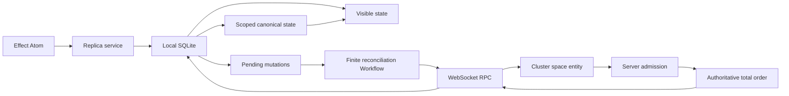

# Effect Local

Effect Local is a local first mutation log for Effect applications. A client commits mutations optimistically to
local SQLite, works while offline, and reconciles with an authoritative server assigned order when connectivity
returns. Effect Schema defines every domain, durable, and wire contract. Effect services, Layers, scopes, streams,
and Atom own the runtime.

The library targets Effect `4.0.0-beta.103`. It has not published a stable release. Durable and public contracts may
change before v1.

## Architecture



One local transaction allocates a stable mutation identity, runs the handler, stores the pending envelope and write
set, and updates visible state. The server authenticates and authorizes the mutation, deduplicates exact retries,
executes the same handler, and either stores a terminal rejection or advances the space's dense mutation sequence.
The submitting client's result remains in its private receipt. Replication sends only the current entities selected
for that client. The client applies those view changes to canonical state and then replays its remaining pending
mutations over that state.

Effect Cluster owns deployment neutral routing and live ownership. One entity per space serializes mutation admission,
holds wake and presence recipients, and routes them across runners. The actor does not retain mutation payloads or
replies in Cluster message history. Server SQL stores authoritative entities, bounded mutation history and receipts,
and a materialized replication view per client. Clients retain pending mutations, a dense view cursor, the global
mutation watermark, durable retractions, and resumable scoped bootstrap staging in SQLite. Effect Workflow owns
durable client scheduling through finite reconciliation generations.

Ordinary fields store ordinary values. Applications that need concurrent intent for a specific field can use an
explicit `Field.Semantics` such as a counter or grow only set. Every other model avoids causal metadata.

See [architecture](docs/architecture.md), [durability](docs/durability.md), and [synchronization](docs/sync.md) for the
invariants and failure model.

## Packages

| Package                              | Purpose                                                           |
| ------------------------------------ | ----------------------------------------------------------------- |
| `@lucas-barake/effect-local`         | Models, mutations, queries, field semantics, protocol, and errors |
| `@lucas-barake/effect-local-sql`     | SQLite state, server log, and Workflow reconciliation             |
| `@lucas-barake/effect-local-rpc`     | WebSocket RPC, Cluster space routing, and presence                |
| `@lucas-barake/effect-local-browser` | Browser SQLite ports, Effect Atom graph, and local presence       |
| `@lucas-barake/effect-local-test`    | Production shaped test layers and deterministic network faults    |

All packages are ESM. Public modules are available as subpaths such as
`@lucas-barake/effect-local/Mutation`. Paths under `internal/*` are private.

## Domain definition

```ts
import * as Definition from "@lucas-barake/effect-local/Definition"
import * as Model from "@lucas-barake/effect-local/Model"
import * as Mutation from "@lucas-barake/effect-local/Mutation"
import * as Query from "@lucas-barake/effect-local/Query"
import * as Effect from "effect/Effect"
import * as Layer from "effect/Layer"
import * as Option from "effect/Option"
import * as Schema from "effect/Schema"

export const Task = Model.make("Task", {
  version: 1,
  key: Schema.String,
  schema: Schema.Struct({
    id: Schema.String,
    title: Schema.NonEmptyString,
    completed: Schema.Boolean
  }),
  indexes: {
    byCompletedTitle: {
      version: 1,
      partition: [{
        name: "completed",
        affinity: "integer",
        schema: Schema.Boolean,
        extract: (task) => task.completed
      }],
      sort: [{
        name: "title",
        affinity: "text",
        schema: Schema.NonEmptyString,
        extract: (task) => task.title
      }]
    }
  }
})

export const PutTask = Mutation.make("PutTask", {
  version: 1,
  payload: Task.schema,
  success: Task.schema
})

export const ToggleTask = Mutation.make("ToggleTask", {
  version: 1,
  payload: { id: Schema.String }
})

export const ListTasks = Query.make("ListTasks", {
  payload: { completed: Schema.Boolean, titleFrom: Schema.optional(Schema.NonEmptyString) },
  success: Schema.Array(Task.schema)
})

export const definition = Definition.make({
  version: 1,
  models: [Task],
  mutations: [PutTask, ToggleTask],
  queries: [ListTasks]
})

export const DomainLive = Layer.mergeAll(
  PutTask.toLayer(({ payload, transaction }) => transaction.set(Task, payload.id, payload).pipe(Effect.as(payload))),
  ToggleTask.toLayer(({ payload, transaction }) =>
    transaction.get(Task, payload.id).pipe(
      Effect.flatMap(Option.match({
        onNone: () => Effect.void,
        onSome: (task) => transaction.set(Task, task.id, { ...task, completed: !task.completed })
      }))
    )
  ),
  ListTasks.toLayer(({ payload, query }) =>
    query.from(Task, "byCompletedTitle")
      .where({
        completed: payload.completed,
        title: payload.titleFrom === undefined ? undefined : { gte: payload.titleFrom }
      })
      .order("asc")
      .limit(50)
      .page()
      .pipe(Effect.map((page) => page.items))
  )
)
```

Handler dependencies are ordinary Effect requirements. `toLayer` captures them once when the Layer is built. Handler
failures declared by the mutation or query Schema stay in the typed error channel. Storage, protocol, capacity,
authorization, and identity failures use the tagged classes in `ReplicaError`.

Handlers must be deterministic. Put timestamps, random values, generated identifiers, and other nondeterministic
inputs in the mutation payload before committing it.

### Indexed queries

Every multi row query names an index declared on its model. Partition components require exact values. The first sort
component accepts `gt`, `gte`, `lt`, and `lte` bounds. Ordering applies to the complete sort tuple, and the encoded
entity key is the stable final tie breaker. Unknown indexes, missing partition fields, extra filter fields, and cursors
from another model or index are type errors.

`page()` fetches at most the configured limit and returns `{ items, next }`. Pass `next` to `after()` for the following
keyset page:

```ts
const tasks = query.from(Task, "byCompletedTitle")
  .where({ completed: false, title: { gte: "A", lt: "N" } })
  .order("asc")
  .limit(25)

const first = yield * tasks.page()
const second = first.next === undefined ? undefined : yield * tasks.after(first.next).page()
```

Use `stream()` when a handler must consume every matching row without materializing the result set first. It advances
through the same bounded keyset pages and decodes only selected entities. The named query still returns a value
accepted by its success Schema, so a live Stream cannot escape through `Replica.query`.

SQLite stores each declared index in an owner qualified shadow table. The migration catalog checks its DDL checksum
and resumes bounded backfills. Local mutations, accepted sync changes, projection replay, and snapshot installation
maintain the active index generation. Index declarations are client local derived storage. Changing one rebuilds the
local layout without changing the wire definition or model schema identity.

Reactive query atoms retain the exact entity and index ranges read by the handler. A write publishes old and new index
points after commit. Only mounted queries whose recorded ranges can change rerun. Reads through `query.get` use exact
space, model, and decoded key tokens. `Query.make` has no static dependency list because runtime reads are the source
of truth.

## SQLite replica

`SqlReplica.layer` assembles one public `Replica` that owns one SQLite database, one synchronization transport, and
any number of joined spaces. Supply the domain handlers, a `SqlClient`, `Crypto`, and a `SyncEngine`:

```ts
import { NodeCrypto } from "@effect/platform-node"
import { SqliteClient } from "@effect/sql-sqlite-node"
import * as SqlReplica from "@lucas-barake/effect-local-sql/SqlReplica"
import * as Identity from "@lucas-barake/effect-local/Identity"
import * as Protocol from "@lucas-barake/effect-local/Protocol"
import * as Replica from "@lucas-barake/effect-local/Replica"
import * as Effect from "effect/Effect"
import * as Layer from "effect/Layer"
import { definition, DomainLive, ListTasks, PutTask, Task } from "./domain.js"

const spaceId = Identity.SpaceId.make("spc_00000000-0000-4000-8000-000000000001")
const clientId = Identity.ClientId.make("cli_00000000-0000-4000-8000-000000000001")
const scope = Protocol.ReplicationScope.make({ models: [Task.name] })

const DatabaseLive = Layer.mergeAll(
  SqliteClient.layer({ filename: "tasks.sqlite" }),
  NodeCrypto.layer
)

const history = {
  settlementCapacity: 64,
  retainedReceipts: 256,
  maximumReceipts: 1_024,
  retainedHistoryEntries: 256,
  maximumBootstrapEntities: 100_000,
  maximumBootstrapBytes: 64 * 1024 * 1024,
  maximumBootstrapPageBytes: 4 * 1024 * 1024,
  migration: { retryDelay: "25 millis", maximumAttempts: 8 }
} as const

export const ReplicaLive = SqlReplica.layer({
  definition,
  clientId,
  scope,
  initialSpaces: [spaceId],
  reconciliationConcurrency: 8,
  ...history
}).pipe(
  Layer.provide(DomainLive),
  Layer.provide(DatabaseLive),
  Layer.provide(SyncLive)
)

const program = Replica.Replica.use((replica) =>
  Effect.gen(function*() {
    const space = yield* replica.space(spaceId)
    const pending = yield* space.mutate(PutTask, {
      id: "task-1",
      title: "Ship the mutation log",
      completed: false
    })
    const inFlight = yield* space.pendingFor(PutTask)
    const task = yield* space.get(Task, "task-1")
    const tasks = yield* space.query(ListTasks, { completed: false })
    return { pending, inFlight, task, tasks }
  })
).pipe(Effect.provide(ReplicaLive), Effect.scoped)
```

Call `replica.join(spaceId)` to add membership, `replica.leave(spaceId)` to evict that space, and `replica.spaces` to
list the current handles. Each handle scopes mutation, entity, query, pending, settlement, receipt, cursor, and status
state to its space.
Leaving cascades through every client table without changing the durable client identity or any other space. A stale
handle returns `SpaceUnavailable`, including after the same space is joined again with a fresh membership incarnation.

`SyncLive` can be the RPC client Layer from the next section or any implementation of `SyncEngine`. Local commits do
not wait for it. One dispatcher owns keyed watches and reconciliation turns for every joined space. A failed or busy
space does not block another space, while all requests still share the one `SyncEngine` and its one RPC WebSocket.
Per space status is available on each handle. `replica.status` returns the sorted aggregate with total pending work.
The explicit Workflow composition persists only reconciliation execution control. Application data stays in the same
SQLite tables used by the in memory composition.

`space.mutate` still completes at the local optimistic commit. It never waits for the server and its error channel
contains only failures from that local run. Use `space.pending` to inspect every in flight mutation, including its
decoded payload, submission state, and attempt count. Use `space.pendingFor(PutTask)` when the mutation specific type
matters. `space.settlements` is a bounded live Stream of terminal `{ pending, receipt }` values. A current subscriber
receives each terminal settlement once after rollback and pending replay have completed. The Stream has no
history. Durable recovery remains `space.receipt(PutTask, mutationId)`. Mutation rejections from either surface are
decoded through `PutTask.rejectionSchema`; authorization, capacity, legacy, and quarantine rejections remain distinct
origin tagged JSON branches. `settlementCapacity` bounds each space's live feed. A subscriber that does not keep up
backpressures settlement delivery and reconciliation, but never the local `mutate` commit. Leaving the space or closing
the replica scope shuts down its settlement Stream.

Use `SqlReplica.layerWorkflow` when reconciliation must recover through Effect Workflow. Supply
`ClusterWorkflowEngine.layer` and the official runner Layer separately. For one SQLite owner this is normally
`SingleRunner.layer({ runnerStorage: "sql" })`. Configure `retryDelay`, `maximumRetryDelay`, and `maximumAttempts` on
`layerWorkflow` to bound one execution's exponential retry history. A later local mutation or server wake creates a
new generation after a terminal failure. `SqlReplica.layer` remains the explicit lightweight in memory choice.

## Replication scope and read authorization

`scope` is the replication subscription for the replica. It applies to every joined space. A scope names fully
replicated models and, separately, windowed models. An empty scope is valid. When a replica starts with a changed
configured scope, it advances a durable scope generation. Widening backfills newly selected entities through ordinary
pull pages. Narrowing sends `Retract` changes so excluded entities disappear locally without replacing the database or
doing a full bootstrap.

A window bounds a model to the newest `count` entities per partition of one of its secondary indexes, ordered by the
index sort descending. Per-partition overrides raise the count or add a leading-sort-component range, which is how a
client pages older history in and evicts it again. Scroll-back and eviction are plain scope changes, so they reuse the
same generation fencing, pages, and retractions as any other scope transition. The client needs no window logic: slid
or evicted entities arrive as retractions. A windowed scope requires the caller to be on the current server schema;
clients mid rolling upgrade keep full model scopes until they upgrade.
One scope can contain at most 1,000 windows and 1,000 partition overrides in total.

```ts
const scope = Protocol.ReplicationScope.make({
  models: [],
  windows: [Protocol.ReplicationWindow.make({ model: "Message", index: "byChat", count: 50 })]
})

const scrolledBack = Protocol.ReplicationScope.make({
  models: [],
  windows: [Protocol.ReplicationWindow.make({
    model: "Message",
    index: "byChat",
    count: 50,
    partitions: [Protocol.ReplicationWindowPartition.make({ key: ["chat-42"], count: 200 })]
  })]
})
```

Steady pulls are derived from the authoritative log suffix since a per-view delivered watermark: the server touches
only the entities that changed, the partitions those changes affected, and the client's acknowledged view, instead of
rescanning the space. The full re-derive remains the fallback for scope changes, schema changes, pruned history, and
read authorization invalidation.

The server computes effective visibility as the intersection of the requested scope and `authorizeRead`. It first
calls the policy with `_tag: "Scope"`, before disclosing space or schema state. It then calls the policy with
`_tag: "Entity"` for every candidate entity. The entity key and value are Schema encoded JSON. A candidate that fails
either check never enters a pull or bootstrap page. Wakes contain no entity payload.

The option callback and a Context service compose directly. The Effect returned by `authorizeRead` may require
services. Those requirements propagate to `ServerStore.layer`, where normal Layer composition supplies them:

```ts
import * as ServerStore from "@lucas-barake/effect-local-sql/ServerStore"
import * as Context from "effect/Context"
import * as Effect from "effect/Effect"
import * as Layer from "effect/Layer"
import * as Schema from "effect/Schema"

class ReadPolicy extends Context.Service<ReadPolicy, {
  readonly authorize: (
    input: ServerStore.ReadAuthorizationInput
  ) => Effect.Effect<void, typeof Schema.Json.Type>
}>()("app/ReadPolicy") {}

const StoreLive = ServerStore.layer({
  ...serverHistory,
  definition,
  readAuthorizationRefreshInterval: "30 seconds",
  maximumConcurrentReadAuthorizations: 64,
  maximumPendingReadAuthorizations: 4_096,
  readAuthorizationCacheCapacity: 4_096,
  authorizeAccess: ({ clientId, principal, spaceId }) => authorizeClient({ clientId, principal, spaceId }),
  authorizeMutation: ({ mutation, principal }) => authorizeMutation({ mutation, principal }),
  authorizeRead: (input) => ReadPolicy.use((policy) => policy.authorize(input))
}).pipe(Layer.provide(ReadPolicyLive))
```

`Delete` means the authoritative entity no longer exists. `Retract` means it still exists but no longer belongs to the
client's scope or visibility. A retraction removes canonical and visible state and leaves a durable fence so an old
optimistic mutation cannot resurrect revoked data. Later authorization can send an `Upsert` and clear the fence.
Watches carry only wake hints. Pull rechecks the policy. `readAuthorizationRefreshInterval` supplies periodic hints so
a policy-only revocation is eventually retracted even when no mutation changes that entity.

Every pull re-evaluates `authorizeRead` for each entity the client currently holds, so a revocation retracts on the
next pull even when the entity itself never changed. The reverse direction is not free under incremental pulls: a
policy flip that newly grants an entity untouched since the client's watermark stays invisible until something changes
it. When authorization depends on external state, call `ServerStore.invalidateReadAuthorization(spaceId)` after that
state changes; the next pull of each affected client re-derives its complete view.

## Server and WebSocket RPC

`ServerStore.layer` persists one dense mutation sequence per space, terminal receipts per client mutation, the
authoritative entity state, and principal bound client views. Its mutation path acquires the space row inside the SQL
transaction, so handler execution, materialization, sequence allocation, and hard capacity checks share one order.
The dense space sequence remains the mutation basis. A separate dense view cursor orders the subset visible to one
client.

Call `ServerStore.maintain` or provide `ServerStore.layerMaintenance` in the server scope. Maintenance prepares the
global recovery snapshot used to expire old mutation and receipt evidence, then reclaims bounded prefixes. Admission
returns `CapacityExceeded` before handler execution when a hard cap is reached, so the maintenance Layer is required
in a long lived deployment. A fresh or invalid client view receives `BootstrapRequired` and installs client, scope,
schema, and principal bound pages into durable staging before one atomic canonical replacement.

`ServerStore.layer` requires `authorizeAccess`, `authorizeMutation`, and `authorizeRead`. Access authorization runs
before retry receipt lookup. Mutation admission rejection consumes the client's local sequence and persists an exact
retry receipt, but does not consume a server sequence. `ServerStore.layerTrusted` is the explicit allow all Layer for
tests and already trusted processes.

`SyncRpc.Rpcs` multiplexes submit, pull, bootstrap, watch, and presence on one Effect RPC WebSocket. The server uses
`Authentication.layerServer`. The client uses `Authentication.layerClient` with an application supplied
`CredentialProvider`. Its `acquire` Effect runs for every RPC and returns a redacted bearer credential plus its
nonnegative generation. `awaitChange(rejectedGeneration)` signals when `acquire` can return a different generation.
A rejected credential changes the space to `NeedsAuthentication` and pauses that generation. Publishing a new
generation resumes synchronization through the same replica and WebSocket.

`CredentialRejected` is a credential problem. `AuthenticatorUnavailable` is a verifier outage and remains retryable.
`AuthorizationDenied` means an authenticated principal lacks permission and is terminal. `OperationTimeout` identifies
the bounded session or RPC operation that expired. Session acquisition, unary RPCs, and stream acquisition default to
10 second timeouts and accept `Duration.Input`. Established watch streams may remain idle. Transient reconciliation
failures use capped exponential backoff from `retryDelay`, default 1 second, through `maximumRetryDelay`, default 1
minute. See [synchronization](docs/sync.md) and the
[`effect-local-rpc` guide](packages/local-rpc/README.md) for the provider contract and socket retry policy.

The authenticated server facade sends all operations to the Cluster entity for the requested space. Cluster supplies
the unique live owner and cross runner stream routing. SQL stores the authoritative accepted log and terminal
receipts. The application chooses Effect's runner storage, message storage, runner transport, and deployment Layers.
It also remains responsible for its HTTP server, WebSocket path, TLS, Origin policy, credential verification, and
tenant authorization. Provide `SyncRpc.layerJson` on both sides. It bounds and sanitizes complete JSON frames. A
reverse proxy or lower level WebSocket upgrade handler must enforce the same native ingress payload limit.

The facade uses four space entities with required finite limits. `SpaceAdmissionEntity` serializes Submit and Discard.
`SpaceReadEntity` forks Pull and Bootstrap. A Layer wide fail fast allowance bounds Bootstrap assertion verification
and preparation. A separate per space allowance bounds immutable page reads. `SpaceWatchEntity` owns long lived sync
and presence streams. `SpacePresencePublishEntity` bounds presence publication. Their separate mailboxes keep a paused
Bootstrap page or a full watch lane from blocking mutation admission. Saturated Bootstrap work fails with typed
`CapacityExceeded` resource `bootstrap authorizations` or `bootstrap pages`.

`ServerStore.maximumWatchersPerSpace` and `PresenceHub.maximumWatchersPerSpace` independently cap active streams.
Their sliding queue capacities bound queued hints per subscriber, not subscriber count. Sync authorization successes
are cached by the complete normalized space, client, scope, and principal input. The refresh interval is the fail closed
revocation bound. Executing policy calls, live authorization callers and owner lookups, completed successes, and active
watchers have separate required limits. The same pending allowance also bounds per-wake visibility work. Pending overflow fails with typed
`CapacityExceeded { resource: "read authorizations", limit }`. Accepted mutations publish one shared postcommit wake.
Delivery performs no SQLite transaction or space row write per watcher.

Effect metrics cover admission and rejection classes, history and receipt depth beside their limits, sync and presence
watcher populations, wake fanout duration, durable bootstrap installs, maintenance and prune volume, and client pending
depth. Labels use bounded categories and never include space or principal identifiers. The production composition
benchmark at `packages/local-rpc/bench/Fanout.bench.ts` exercises 64, 256, and 1,024 watchers.

## Effect Atom

```ts
import * as BrowserReplica from "@lucas-barake/effect-local-browser/BrowserReplica"

export const graph = BrowserReplica.make(ReplicaLive)

export const taskAtom = graph.entity(spaceId, Task)("task-1")
export const tasksAtom = graph.query(spaceId, ListTasks)({ completed: false })
export const putTaskAtom = graph.mutation(spaceId, PutTask)
export const pendingTasksAtom = graph.pendingFor(spaceId, PutTask)
export const taskSettlementsAtom = graph.settlementsFor(spaceId, PutTask)
export const spaceStatusAtom = graph.status(spaceId)
export const replicaStatusAtom = graph.aggregateStatus
export const spacesAtom = graph.spaces
export const joinAtom = graph.join
export const leaveAtom = graph.leave
```

The graph defaults to Effect's shared `Atom.runtime`, so every graph participates in one application memo map. Entity
atoms register exact space addressed keys. Query atoms also retain the entity keys and index ranges their handler
actually read. Local commits and reconciliation batches refresh only affected mounted reads. Mutation, pending,
receipt, and status atoms also require a space address. A settlement atom resolves to the lazy live Stream. Mounting
the atom does not consume or replay events. Materializing that Stream owns one scoped subscription. The membership and
aggregate atoms share the same runtime. Mutation atoms are concurrent and preserve their typed result. Pass an
application factory with `options.factory` when the application already owns a deliberate custom runtime.

## Selective field semantics

```ts
import * as Field from "@lucas-barake/effect-local/Field"

const next = yield* transaction.applyField(Field.counter, currentCount, {
  _tag: "Increment",
  delta: 1
})
```

`Field.register`, `Field.counter`, and `Field.growOnlySet` describe explicit operations. Store the returned value in
the enclosing model through the same transaction. These semantics are domain tools, not a replication substrate.

## Testing

`TestServer.layer` adapts the real authoritative store to a production shaped `SyncEngine`. `FaultInjection` can
partition and heal the link, drop the next receipt after the server commits it, and duplicate the next catch up page.
`TestReplica.layer` is the same `SqlReplica` composition used in production.

The repository runs on Node `22.22.2`, `24.15.0`, or `26+`.

```sh
pnpm install --frozen-lockfile
pnpm check:pre-commit
pnpm build
pnpm circular
pnpm bench
```

## Rolling schema and protocol deployments

A rolling deployment can keep the previous application bundle online while the new server and client bundle roll
out. Application schema compatibility and wire protocol compatibility are separate controls. The server schema window
determines which old domain definitions can still sync. Protocol negotiation determines whether two library versions
can speak the same wire format.

Deploy the compatible server first. A new client cannot negotiate with a server that does not expose the negotiation
RPC, and an old client needs the new server to project current data back to its schema.

### Define both migration directions

Forward transforms let the current server execute an old mutation. Downgrade transforms let that server return
receipts, pull entries, and bootstrap snapshots that the old client can decode. For example, suppose version 2 adds a
`completed` field to `Task` and `PutTask`:

```ts
import * as Evolution from "@lucas-barake/effect-local/Evolution"

export const evolution = Evolution.make({
  current: definitionV2,
  steps: [Evolution.step({
    id: "definition/1-to-2",
    from: definitionV1,
    to: definitionV2,
    models: [Evolution.model({
      id: "task/1-to-2",
      from: TaskV1,
      to: TaskV2,
      value: ({ value }) => ({ ...value, completed: false }),
      downgradeValue: ({ value }) => ({
        id: value.id,
        title: value.title
      })
    })],
    mutations: [Evolution.mutation({
      id: "put-task/1-to-2",
      from: PutTaskV1,
      to: PutTaskV2,
      payload: (payload) => ({ ...payload, completed: false }),
      success: (success) => ({ ...success, completed: false }),
      downgradePayload: ({ id, title }) => ({ id, title }),
      downgradeSuccess: ({ id, title }) => ({ id, title })
    })]
  })]
})
```

Pass the same `evolution` catalog to the server and the current `SqlReplica`. The client uses it to promote durable
local state and pending mutations. The server uses it to admit old callers and project current data to them.

### Open the server schema window

`acceptedSchemaVersions` counts immediately preceding definitions in the evolution chain. A value of `1` accepts the
current definition and version N minus 1. Server layer construction fails with `InvalidConfiguration` if the requested
window is missing a required downgrade transform.

```ts
import * as ServerStore from "@lucas-barake/effect-local-sql/ServerStore"

export const ServerLive = ServerStore.layer({
  ...serverHistory,
  definition: definitionV2,
  evolution,
  acceptedSchemaVersions: 1,
  authorizeAccess: ({ clientId, principal, spaceId }) => authorizeClient({ clientId, principal, spaceId }),
  authorizeMutation: ({ mutation, principal }) => authorizeMutation({ mutation, principal }),
  authorizeRead: (input) => ReadPolicy.use((policy) => policy.authorize(input))
})
```

The authorization functions above are application Effects. Their requirements propagate to the server Layer.
`ServerStore.layerTrusted` remains for tests and already trusted processes. Do not use a digest as authorization.
Client and space ownership belongs in `authorizeAccess`.

### Negotiate one protocol for sync and presence

During a protocol rollout, advertise the overlap on the server and share one client `ProtocolSession` between sync and
presence. Sharing the session gives both services one selected version and one renegotiation gate.

```ts
import * as PresenceClient from "@lucas-barake/effect-local-rpc/PresenceClient"
import * as ProtocolSession from "@lucas-barake/effect-local-rpc/ProtocolSession"
import * as SyncClient from "@lucas-barake/effect-local-rpc/SyncClient"
import * as SyncServer from "@lucas-barake/effect-local-rpc/SyncServer"
import * as Layer from "effect/Layer"

export const ServerRpcLive = SyncServer.layerWithOptions({
  supportedProtocolVersions: [1, 2]
})

const session = ProtocolSession.layerWithOptions({
  supportedProtocolVersions: [1, 2],
  sessionAcquisitionTimeout: "10 seconds"
})

export const ClientRpcLive = Layer.merge(
  SyncClient.layerFromSession({ rpcTimeout: "10 seconds" }),
  PresenceClient.layerFromSession({ rpcTimeout: "10 seconds" })
).pipe(
  Layer.provide(session),
  Layer.provide(RpcProtocolLive),
  Layer.provide(AuthenticationLive)
)
```

Negotiation selects the highest shared version. A rolling peer that rejects a cached version causes one renegotiation
and retry. If there is no common version, the client receives terminal `UpgradeRequired` instead of retrying a decode
failure forever.

### Prompt compatible old clients to reload

An accepted old client continues syncing. Its space status changes to `SchemaUpdateAvailable`, which includes the
server schema identity so the application can show a reload prompt without treating the replica as failed.

```ts
import * as Replica from "@lucas-barake/effect-local/Replica"
import * as Effect from "effect/Effect"

export const promptForReload = Replica.Replica.use((replica) =>
  Effect.gen(function*() {
    const space = yield* replica.space(spaceId)
    const status = yield* space.status

    if (status._tag === "SchemaUpdateAvailable") {
      yield* showReloadPrompt({ serverVersion: status.serverSchema.version })
    }
  })
)
```

### Recover a rejected pending mutation

If a pending mutation cannot be replayed during client schema promotion, startup still completes. The original
envelope and typed rejection move to durable quarantine. That item blocks later pending work from passing its local
sequence until the application resubmits a corrected payload or explicitly discards it.

```ts
import * as Replica from "@lucas-barake/effect-local/Replica"
import * as Effect from "effect/Effect"

export const recoverQuarantine = Replica.Replica.use((replica) =>
  Effect.gen(function*() {
    const space = yield* replica.space(spaceId)
    const [item] = yield* space.quarantine

    if (item !== undefined) {
      const result = yield* space.resubmitQuarantined(
        item.envelope.mutationId,
        PutTaskV2,
        { id: "task-1", title: "Ship safely", completed: false }
      )

      if (result._tag === "Resubmitted") {
        yield* showRecoveredMutation(result.pending.envelope.mutationId)
      }
    }
  })
)
```

Use `space.discardQuarantined(item.envelope.mutationId)` when the operation should never run. Discard advances the
server side client sequence without executing the mutation handler. Both operations are idempotent across interruption
and restart.

The complete deployment sequence is:

1. Deploy a server that accepts the old schema and advertises both protocol versions.
2. Deploy the new client bundle with the same evolution catalog and protocol overlap.
3. Prompt compatible old clients to reload and monitor their remaining usage.
4. Reduce `acceptedSchemaVersions` only after the application deprecation horizon.
5. Remove the old protocol version only after no deployed client requires it.

## Guarantees and limits

- Local mutation commit is atomic in SQLite and does not require a network.
- Exact mutation retries are idempotent. Reusing an identity with different canonical bytes fails.
- Accepted server sequences are dense per space. Clients install only contiguous entries.
- Pull entries expose only public mutation identity and canonical changes. Payloads and success results are not in the
  shared authoritative log.
- Steady sync cost is proportional to the changed entities and the client's acknowledged view, not to space size. A
  windowed scope bounds the acknowledged view, so per-message sync stays flat as server history grows. Received pages
  and settlements apply incrementally on the client; the full projection rebuild remains for bootstrap, revocation,
  schema evolution, and crash recovery.
- A terminal rejection rolls back its optimistic write set and replays remaining pending mutations.
- Queues, mutation payloads, presence payloads, pull pages, bootstrap pages, snapshots, receipts, and retained history
  are bounded by explicit configuration.
- Presence is best effort, bounded, TTL based, and never enters the durable mutation log.
- Cluster routes each space to one live owner across runners. Entity operations are volatile. A failed submit remains
  in the client's pending SQLite outbox until exact resubmission returns the SQL backed terminal receipt. Pull and watch
  recover from the durable server sequence.
- Workflow executions are finite and generation keyed. SQLite progress repairs lost wakes and browser termination when
  a runner starts again.
- The server is an authority, not a peer. Conflict behavior is arrival order unless a handler explicitly applies field
  semantics.
- SQL storage schemas advance through an ordered checksum validated migration catalog. A lifecycle migration still
  requires old server writers to stop before they can issue a legacy SQL write shape. This is separate from the
  supported mixed application schema and wire protocol window. There is no backward SQL migration, multi writer
  browser ownership coordinator, encryption layer, or stable v1 compatibility promise yet.
