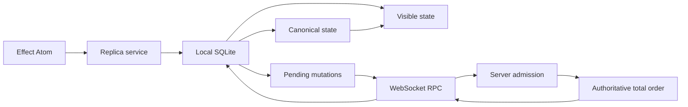

# Effect Local

Effect Local is a local first mutation log for Effect applications. A client commits mutations optimistically to
local SQLite, works while offline, and reconciles with an authoritative server assigned order when connectivity
returns. Effect Schema defines every domain, durable, and wire contract. Effect services, Layers, scopes, streams,
and Atom own the runtime.

The library targets Effect `4.0.0-beta.101`. It has not published a stable release. Durable and public contracts may
change before v1.

## Architecture



One local transaction allocates a stable mutation identity, runs the handler, stores the pending envelope and write
set, and updates visible state. The server authenticates and authorizes the mutation, deduplicates exact retries,
executes the same handler, and either stores a terminal rejection or appends an accepted mutation with the next dense
sequence. A client installs contiguous accepted entries into canonical state and then replays its remaining pending
mutations over that state.

Ordinary fields store ordinary values. Applications that need concurrent intent for a specific field can use an
explicit `Field.Semantics` such as a counter or grow only set. Every other model avoids causal metadata.

See [architecture](docs/architecture.md), [durability](docs/durability.md), and [synchronization](docs/sync.md) for the
invariants and failure model.

## Packages

| Package                              | Purpose                                                           |
| ------------------------------------ | ----------------------------------------------------------------- |
| `@lucas-barake/effect-local`         | Models, mutations, queries, field semantics, protocol, and errors |
| `@lucas-barake/effect-local-sql`     | Client SQLite state, authoritative server log, and reconciliation |
| `@lucas-barake/effect-local-rpc`     | Authenticated Effect RPC over WebSockets, including presence      |
| `@lucas-barake/effect-local-browser` | Browser SQLite ports, Effect Atom graph, and local presence       |
| `@lucas-barake/effect-local-test`    | Production shaped test layers and deterministic network faults    |

All packages are ESM. Public modules are available as subpaths such as
`@lucas-barake/effect-local/Mutation`. Paths under `internal/*` are private.

## Domain definition

```ts
import * as Definition from "@lucas-barake/effect-local/Definition"
import * as Model from "@lucas-barake/effect-local/Model"
import * as Mutation from "@lucas-barake/effect-local/Mutation"
import * as Query from "@lucas-barake/effect-local/Query"
import * as Effect from "effect/Effect"
import * as Layer from "effect/Layer"
import * as Option from "effect/Option"
import * as Schema from "effect/Schema"

export const Task = Model.make("Task", {
  key: Schema.String,
  schema: Schema.Struct({
    id: Schema.String,
    title: Schema.NonEmptyString,
    completed: Schema.Boolean
  })
})

export const PutTask = Mutation.make("PutTask", {
  payload: Task.schema,
  success: Task.schema
})

export const ToggleTask = Mutation.make("ToggleTask", {
  payload: { id: Schema.String }
})

export const ListTasks = Query.make("ListTasks", {
  success: Schema.Array(Task.schema),
  dependsOn: [Task]
})

export const definition = Definition.make({
  models: [Task],
  mutations: [PutTask, ToggleTask],
  queries: [ListTasks]
})

export const DomainLive = Layer.mergeAll(
  PutTask.toLayer(({ payload, transaction }) => transaction.set(Task, payload.id, payload).pipe(Effect.as(payload))),
  ToggleTask.toLayer(({ payload, transaction }) =>
    transaction.get(Task, payload.id).pipe(
      Effect.flatMap(Option.match({
        onNone: () => Effect.void,
        onSome: (task) => transaction.set(Task, task.id, { ...task, completed: !task.completed })
      }))
    )
  ),
  ListTasks.toLayer(({ query }) => query.all(Task))
)
```

Handler dependencies are ordinary Effect requirements. `toLayer` captures them once when the Layer is built. Handler
failures declared by the mutation or query Schema stay in the typed error channel. Storage, protocol, capacity,
authorization, and identity failures use the tagged classes in `ReplicaError`.

Handlers must be deterministic. Put timestamps, random values, generated identifiers, and other nondeterministic
inputs in the mutation payload before committing it.

## SQLite replica

`SqlReplica.layer` assembles the public `Replica` service from a local store, query executor, and scoped reconciler.
Supply the domain handlers, a `SqlClient`, `Crypto`, and a `SyncEngine`:

```ts
import { NodeCrypto } from "@effect/platform-node"
import { SqliteClient } from "@effect/sql-sqlite-node"
import * as SqlReplica from "@lucas-barake/effect-local-sql/SqlReplica"
import * as Identity from "@lucas-barake/effect-local/Identity"
import * as Replica from "@lucas-barake/effect-local/Replica"
import * as Effect from "effect/Effect"
import * as Layer from "effect/Layer"
import { definition, DomainLive, ListTasks, PutTask, Task } from "./domain.js"

const spaceId = Identity.SpaceId.make("spc_00000000-0000-4000-8000-000000000001")
const clientId = Identity.ClientId.make("cli_00000000-0000-4000-8000-000000000001")

const DatabaseLive = Layer.mergeAll(
  SqliteClient.layer({ filename: "tasks.sqlite" }),
  NodeCrypto.layer
)

export const ReplicaLive = SqlReplica.layer({ definition, spaceId, clientId }).pipe(
  Layer.provide(DomainLive),
  Layer.provide(DatabaseLive),
  Layer.provide(SyncLive)
)

const program = Replica.Replica.use((replica) =>
  Effect.gen(function*() {
    const pending = yield* replica.mutate(PutTask, {
      id: "task-1",
      title: "Ship the mutation log",
      completed: false
    })
    const task = yield* replica.get(Task, "task-1")
    const tasks = yield* replica.query(ListTasks, undefined)
    return { pending, task, tasks }
  })
).pipe(Effect.provide(ReplicaLive), Effect.scoped)
```

`SyncLive` can be the RPC client Layer from the next section or any implementation of `SyncEngine`. Local commits do
not wait for it. The scoped reconciler retries pending mutations with their stable identity and resumes pulls from the
durable server cursor.

## Server and WebSocket RPC

`ServerStore.layer` persists one dense accepted sequence per space, terminal receipts per client mutation, and the
authoritative entity state. Its mutation path acquires the space row inside the SQL transaction, so handler execution,
materialization, and sequence allocation share one order. SQLite and PostgreSQL both support the required
`UPDATE ... RETURNING` operation.

Use `authorize` for mutation admission and `authorizeRead` for pull and watch access. Rejections consume the client's
local sequence and persist an exact retry receipt, but do not consume a server sequence.

`SyncRpc.Rpcs` multiplexes submit, pull, watch, and presence on one Effect RPC WebSocket. The server uses
`Authentication.layerServer`; the client uses `Authentication.layerClient`, which writes a redacted bearer credential
to the request headers. `SyncServer.layer` and `SyncClient.layer` contain the typed handler and client adapters. The
application remains responsible for its HTTP server, WebSocket path, TLS, Origin policy, credential verification, and
tenant authorization.

## Effect Atom

```ts
import * as BrowserReplica from "@lucas-barake/effect-local-browser/BrowserReplica"

export const graph = BrowserReplica.make(ReplicaLive)

export const taskAtom = graph.entity(Task)("task-1")
export const tasksAtom = graph.query(ListTasks)(undefined)
export const putTaskAtom = graph.mutation(PutTask)
export const replicaStatusAtom = graph.status
```

One `Atom.context` and memo map own the runtime. Entity and query atoms register Effect `Reactivity` keys and refresh
after local commits and reconciliation transactions. Mutation atoms are concurrent and preserve their typed result.
Pass an application factory with `options.factory` when the application already owns an Atom context.

## Selective field semantics

```ts
import * as Field from "@lucas-barake/effect-local/Field"

const next = yield* transaction.applyField(Field.counter, currentCount, {
  _tag: "Increment",
  delta: 1
})
```

`Field.register`, `Field.counter`, and `Field.growOnlySet` describe explicit operations. Store the returned value in
the enclosing model through the same transaction. These semantics are domain tools, not a replication substrate.

## Testing

`TestServer.layer` adapts the real authoritative store to a production shaped `SyncEngine`. `FaultInjection` can
partition and heal the link, drop the next receipt after the server commits it, and duplicate the next catch up page.
`TestReplica.layer` is the same `SqlReplica` composition used in production.

The repository runs on Node `22.22.2`, `24.15.0`, or `26+`.

```sh
pnpm install --frozen-lockfile
pnpm check:pre-commit
pnpm build
pnpm circular
pnpm bench
```

## Guarantees and limits

- Local mutation commit is atomic in SQLite and does not require a network.
- Exact mutation retries are idempotent. Reusing an identity with different canonical bytes fails.
- Accepted server sequences are dense per space. Clients install only contiguous entries.
- A terminal rejection rolls back its optimistic write set and replays remaining pending mutations.
- Queues, mutation payloads, presence payloads, pull counts, and pull bytes are bounded.
- Presence is best effort, bounded, TTL based, and never enters the durable mutation log.
- The server is an authority, not a peer. Conflict behavior is arrival order unless a handler explicitly applies field
  semantics.
- There is no protocol version negotiation, migration framework, compaction protocol, multi writer browser ownership
  coordinator, encryption layer, or stable v1 compatibility promise yet.
