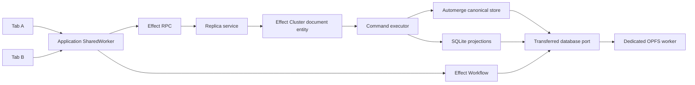

# Architecture

## Boundaries

Effect Local has one durable authority per origin within a browser profile. The application SharedWorker owns it.
Tabs are scoped clients. The OPFS SQLite worker is a separate protocol process and never owns application behavior.

The worker services stay injectable. The page provides `Worker.WorkerPlatform` and `Worker.Spawner`. The owner
requires a `DatabasePort`. Tests replace those layers without changing domain code.

Each tab session is bound to its Effect RPC transport client. Commit invalidations use one bounded subscription per
tab with an owner epoch, sequence watermark, and sticky refresh generation. Gaps and restore rewinds force a full
refresh. The fixed RPC client retries renewal and invalidation transport failures with a bounded policy. Exhausting
that policy requires recreating the enclosing runtime because Effect beta.99 exposes no transport replacement hook
for reconstructing the session in place.

## State ownership

1. Automerge changes and verified checkpoints are canonical replicated state.
2. SQLite projection tables are disposable indexes over canonical state.
3. Cluster mailbox rows and replies are durable execution records.
4. Workflow journals are durable orchestration records.
5. Atom values are reactive caches.
6. Presence and tab sessions are ephemeral.

Cluster and Workflow do not replace Automerge. They serialize local effects, resolve retry ambiguity, and resume
operations after process loss. Automerge remains responsible for causal history, conflicts, and convergence.

## Domain API

Applications define schema coded `Document`, `Mutation`, `Projection`, and `Query` values, then collect them in one
`ReplicaDefinition`. Mutation handlers and SQL bindings are Effect services. This keeps domain definitions portable
while making every runtime dependency visible through Layer requirements.

One ordinary mutation targets one document. The engine does not claim replicated transactions across documents.
Applications that need an invariant across multiple documents must model one aggregate document or use a workflow
whose intermediate states are explicit.

## Browser lifecycle

The first page creates a dedicated OPFS worker and transfers its `MessagePort` with an RPC port to the SharedWorker.
The owner claims a new writer generation before accepting commands. Every write validates that generation. A stale
owner can no longer commit after another owner takes over.

The provisioning contract requires a live page to create the OPFS worker. Provision requests carry an expiring
nonce so an unresponsive candidate cannot stall later tabs. A new attachment probes the provider page over its
control port and reprovisions a stale owner against the same OPFS database after bounded disposal. An already attached
secondary tab does not yet promote itself when the provisioning tab disappears. That limitation remains visible
rather than hidden behind a nonexistent global worker constructor. The dedicated database worker holds a Web Lock
for the database lifetime, so a replacement waits instead of opening OPFS concurrently with a slow prior owner.

OPFS starts as best effort origin storage. The engine does not turn that bucket persistent by itself. Applications
must request `navigator.storage.persist()`, show whether the grant was accepted, and keep user controlled exports.
