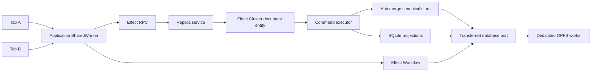
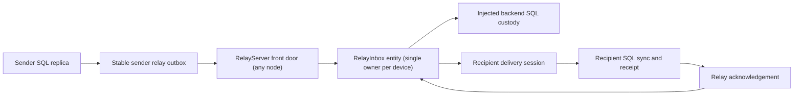

# Architecture

## Boundaries

Effect Local has one durable authority per origin within a browser profile. The application SharedWorker owns it.
Tabs are scoped clients. The OPFS SQLite worker is a separate protocol process and never owns application behavior.

```mermaid
flowchart LR
  TabA["Tab A"] --> Shared["Application SharedWorker"]
  TabB["Tab B"] --> Shared
  Shared --> Rpc["Effect RPC"]
  Rpc --> Replica["Replica service"]
  Replica --> Entity["Effect Cluster document entity"]
  Entity --> Commands["Command executor"]
  Commands --> Store["Automerge canonical store"]
  Commands --> Projections["SQLite projections"]
  Shared --> Workflow["Effect Workflow"]
  Store --> Port["Transferred database port"]
  Projections --> Port
  Workflow --> Port
  Port --> Opfs["Dedicated OPFS worker"]
```

The worker services stay injectable. The page provides `Worker.WorkerPlatform` and `Worker.Spawner`. The owner
requires a `DatabasePort`. Tests replace those layers without changing domain code.

Each tab session is bound to its Effect RPC transport client. Commit invalidations use one bounded subscription per
tab with an owner epoch, sequence watermark, and sticky refresh generation. Gaps and restore rewinds force a full
refresh. The fixed RPC client retries renewal and invalidation transport failures with a bounded policy. Exhausting
that policy requires recreating the enclosing runtime because Effect beta.99 exposes no transport replacement hook
for reconstructing the session in place.

## State ownership

1. Automerge changes and verified checkpoints are canonical replicated state.
2. SQLite projection tables are disposable indexes over canonical state.
3. Cluster mailbox rows and replies are durable execution records.
4. Workflow journals are durable orchestration records.
5. Atom values are reactive caches.
6. Presence and tab sessions are ephemeral.
7. Sender relay outbox rows are temporary durable transfer state in frontend SQLite.
8. Relay custody rows are temporary durable delivery state in the configured backend SQL database.

Cluster and Workflow do not replace Automerge. They serialize local effects, resolve retry ambiguity, and resume
operations after process loss. Automerge remains responsible for causal history, conflicts, and convergence.

## Relay topology

Effect RPC uses one durable protocol. Version `1` uses `PeerRpc.Rpcs` over a standard Effect RPC socket with
`RpcSerialization`, `RelayServer.layerHandlers` for the front door, and `RelayServer.layer` to compose the front door
with the entity behaviour and its retention singleton.

```mermaid
flowchart LR
  Sender["Sender SQL replica"] --> Outbox["Stable sender relay outbox"]
  Outbox --> FrontDoor["RelayServer front door (any node)"]
  FrontDoor --> Entity["RelayInbox entity (single owner per device)"]
  Entity --> Custody["Injected backend SQL custody"]
  Entity --> RecipientSession["Recipient delivery session"]
  RecipientSession --> Receipt["Recipient SQL sync and receipt"]
  Receipt --> Ack["Relay acknowledgement"]
  Ack --> Entity
```

Endpoint ownership, routing, and cross node wakeups come from cluster sharding rather than from process local state,
so several relay nodes may serve one database as active active. The entity that owns a device is the sole writer for
that device's inbox, which is what makes custody need no distributed protocol of its own. The supplied `SqlClient` may
target SQLite, PostgreSQL, or MySQL. The relay requires a `Sharding` and never builds one: single process in memory,
one runner over SQL, and many sharded runners are all the application's choice.

Relay ordering is FIFO within one exact directed peer channel, where a channel includes the sender's connection
epoch. Distinct channels progress concurrently, so one stalled sender cannot block another. Delivery is stop and wait
within a channel: nothing is offered behind an unsettled message. See
[Store and forward](store-and-forward.md) for delivery, capacity, security, and lifecycle details.

Relay infrastructure treats the Automerge message as opaque. It validates the envelope Schema, endpoint and document
routing, hashes, outer digest, and writer provenance shape. Relay enabled `PeerSync` performs the one semantic
Automerge decode.

That boundary is explicit because Automerge `3.3.2` has no allocation bounded decode API. Ordinary authentication and
document authorization do not imply resource trust. `PeerRelayAuthorization` requires a second exact
`UnsafeUnboundedAutomerge3DecodeGrant` for relay admission and delivery. Its principal, remote, direction, documents,
finite lease, and revocation Effect are all scoped and validated. Default deny is
`denyUnsafeUnboundedAutomerge3Decode`.

Fresh ordinary and unsafe grants feed a local operation gate. Revocation that reaches the gate first prevents SQL
mutation or payload emission. An operation admitted first may finish and returns its real result. Revocation drains
that bounded in flight work and blocks later work. This is a local ordering boundary, not an atomic transaction
between SQLite and an external policy authority.

## Domain API

Applications define schema coded `Document`, `Mutation`, `Projection`, and `Query` values, then collect them in one
`ReplicaDefinition`. Mutation handlers and SQL bindings are Effect services. This keeps domain definitions portable
while making every runtime dependency visible through Layer requirements.

One ordinary mutation targets one document. The engine does not claim replicated transactions across documents.
Applications that need an invariant across multiple documents must model one aggregate document or use a workflow
whose intermediate states are explicit.

## Browser lifecycle

The first page creates a dedicated OPFS worker and transfers its `MessagePort` with an RPC port to the SharedWorker.
The owner claims a new writer generation before accepting commands. Every write validates that generation. A stale
owner can no longer commit after another owner takes over.

The provisioning contract requires a live page to create the OPFS worker. Provision requests carry an expiring
nonce so an unresponsive candidate cannot stall later tabs, and a candidate that cannot answer or cannot produce a
healthy engine is dropped until it attaches again. Every attach and every live engine is verified with a round trip
through the database worker itself, never through the provisioning page, so a dead database behind a live page is
still detected. On takeover the coordinator tells every served tab to re-attach and provisions the next engine among
all attached tabs, so a secondary tab is handed off to the new owner instead of being stranded. The dedicated
database worker holds a Web Lock for the database lifetime, so a replacement waits instead of opening OPFS
concurrently with a slow prior owner.

OPFS starts as best effort origin storage. The engine does not turn that bucket persistent by itself. Applications
must request `navigator.storage.persist()`, show whether the grant was accepted, and keep user controlled exports.
